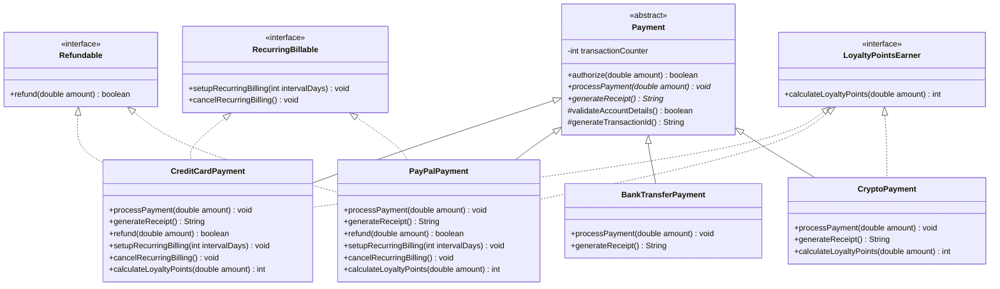

## Problem: Design a Payment Processing System

Your company is building a payment processing system for an e-commerce platform. You need to model the following requirements:

1. **All payment methods** (Credit Card, PayPal, Bank Transfer, Cryptocurrency) must be able to:
   - `authorize(double amount)` — validate the payment can proceed
   - `processPayment(double amount)` — execute the transaction
   - `generateReceipt()` — return a formatted receipt string

2. **Some payment methods share common behavior**:
   - Credit Card and Bank Transfer both need to **validate a routing/account number format** before processing, and this validation logic is *identical* for both (a shared `validateAccountDetails()` method with real, non-abstract implementation).
   - All payment methods need a **transaction ID generator** — this logic is also identical across all types (e.g., using a shared counter + timestamp), and should not be reimplemented in every class.

3. **Some payment methods can ALSO be refunded**, but not all. Cryptocurrency payments, for instance, **cannot** be refunded once processed (irreversible by design), while Credit Card and PayPal **can** be refunded.

4. **Some payment methods can ALSO support recurring/subscription billing** (e.g., Credit Card, PayPal), while others (Bank Transfer, Cryptocurrency) cannot.

5. A `LoyaltyPointsEarner` capability should be **mixable** into any payment method that qualifies for loyalty points — but a class might already extend something else, so this must not block that.

---

### Your Tasks

**Part A — Design**
Design the class/interface hierarchy for this system. For each type you introduce, state explicitly:
- Whether it is an **abstract class** or an **interface**
- **Why** you chose one over the other for that specific case (reference the requirement that drove the decision)

**Part B — Implementation**
Implement the hierarchy in Java, including:
- At least one abstract class with **both abstract and concrete (shared) methods**
- At least two interfaces representing **optional/mixable capabilities** (`Refundable`, `RecurringBillable`, `LoyaltyPointsEarner`)
- Four concrete classes: `CreditCardPayment`, `PayPalPayment`, `BankTransferPayment`, `CryptoPayment` — each implementing/extending the correct combination of types

**Part C — Justification Questions**
Answer briefly (2–3 sentences each):
1. Why can't `validateAccountDetails()` and the transaction ID generator live in an interface instead of an abstract class?
2. Why can't `Refundable` and `RecurringBillable` be implemented as abstract classes instead of interfaces?
3. Suppose a new requirement arrives: "All payment methods must log every transaction to an external audit system with identical logging logic." Would you add this to the abstract class or a new interface? Justify your answer.
4. If `CryptoPayment` needed to both extend the abstract payment class **and** gain the ability to be `LoyaltyPointsEarner`, why does this design still work in Java, whereas it would fail if `LoyaltyPointsEarner` were also an abstract class?

---

### What this problem is testing

| Concept | Where it's tested |
|---|---|
| Abstract class = shared *state* + shared *implementation* + "is-a" relationship | Common `validateAccountDetails()`, transaction ID generator |
| Interface = capability/contract, no shared state, supports multiple inheritance | `Refundable`, `RecurringBillable`, `LoyaltyPointsEarner` mixed independently |
| Single inheritance limitation of abstract classes | Part C, Q4 |
| When *not* to force everything into one abstract class | Recognizing Crypto shouldn't implement `Refundable` |
| Real-world modularity/extensibility reasoning | Q3 — new cross-cutting requirement |

---

### Sample Rubric (for grading)

- **Correct identification of abstract class use** (shared implementation + partial abstraction) — 25%
- **Correct identification of interface use** (optional, mixable, no shared implementation needed) — 25%
- **Correct compiling implementation** with proper method combinations per class — 30%
- **Justification quality** — reasoning grounded in *design principles* (not just "interfaces don't have constructors") — 20%

---

